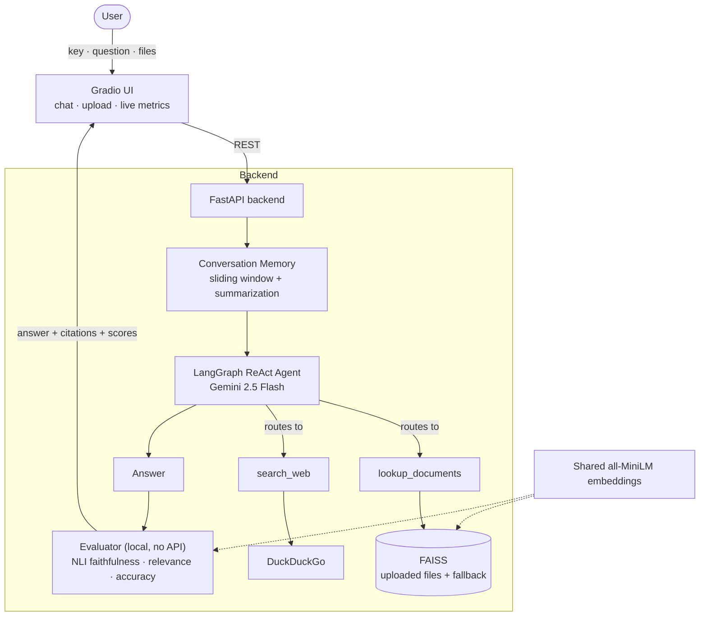

# Agentic RAG Knowledge Search

An agentic RAG assistant that decides **where** to find an answer (your uploaded documents or the live web), then **scores its own answer** for hallucinations, all running on free/CPU infrastructure.

Built with **LangGraph, FastAPI, Gradio, FAISS, Google Gemini, and Docker**.


🔗 **[Live Demo on HuggingFace Spaces »](https://huggingface.co/spaces/Devisri515/Agentic_RAG_Knowledge_Search)** : bring your own free [Gemini key](https://aistudio.google.com/apikey) and try it.

## What it does

A LangGraph ReAct agent answers questions by autonomously routing between two tools:

- **`lookup_documents`**: semantic search (FAISS) over user-uploaded files, falling back to a bundled knowledge base.
- **`search_web`**: DuckDuckGo for current or general information.

Every answer is then graded in real time by **local evaluation models** (no extra API calls), and the conversation is remembered across turns with automatic summarization to keep cost bounded.

## Highlights

- **Self-evaluating**: each response is scored for *faithfulness* (hallucination detection via NLI), *answer relevance*, and optional *accuracy*, computed locally and shown live in the UI.
- **Hallucination detection that works**: it uses natural-language *entailment*, not just embedding similarity, so it catches answers that **contradict** the source (which cosine similarity misses).
- **Runtime document upload**: drop in PDF, DOCX, TXT, MD, or CSV files; they're indexed instantly and searched first.
- **Conversational memory**: follow-up questions resolve correctly, and older turns are auto-summarized to bound token cost in long chats.
- **Bring Your Own Key (BYOK)**: each user supplies their own Gemini key, so the public demo costs the owner nothing and never exhausts a shared quota.
- **Production touches**: single-image Docker deployment, a `pytest` suite, GitHub Actions CI with `ruff` linting, and a documented REST API.

## Demo

The screenshots below are from the [live HuggingFace Space](https://huggingface.co/spaces/Devisri515/Agentic_RAG_Knowledge_Search), using a résumé as the uploaded document.

**1. Setup: your key and your documents.** Enter your own Gemini key (BYOK) and upload files; they're indexed on the spot (here, a résumé becomes 11 chunks).


**2. Document Q&A (RAG).** Ask about the uploaded file, and the agent retrieves the relevant chunks and answers with a source citation.


**3. Conversational memory.** A follow-up like *"Which of those are from AWS?"* is resolved from the previous turn. Note `Source: Unknown`, meaning the agent answered from memory without re-querying the document.


**4. No hallucination, plus live metrics.** Asked for a salary that isn't in the document, the agent says so instead of inventing one. The **Evaluation Metrics** panel scores every answer locally: faithfulness, answer relevance, and (with a reference) accuracy. *(Faithfulness is low here precisely because a refusal makes no fact that can be "grounded" in the source.)*


## Architecture



## Evaluation metrics

Computed locally after every response: free, fast, and CPU-only.

| Metric | When | How | Catches |
|---|---|---|---|
| **Faithfulness** | Always | NLI entailment (`DeBERTa-v3-base-mnli-fever-anli`) of each answer claim against the source sentences it used | Hallucinations and contradictions |
| **Answer Relevance** | Always | Cosine similarity (question vs answer, `all-MiniLM-L6-v2`) | Off-topic or evasive answers |
| **Accuracy** | With a reference | ROUGE-L F1 vs an expected answer | Drift from a known-correct answer |

> **Why NLI over plain similarity?** "The treaty *can* be terminated" and "the treaty *cannot* be terminated" have near-identical cosine similarity despite opposite meaning. NLI checks logical entailment, so it flags the contradiction as unfaithful.

## Tech stack

| Layer | Choice |
|---|---|
| Agent / orchestration | LangGraph, LangChain |
| LLM | Google Gemini 2.5 Flash |
| Retrieval | FAISS + HuggingFace `all-MiniLM-L6-v2` embeddings |
| Evaluation | `DeBERTa-v3-base-mnli-fever-anli` (NLI), ROUGE-L |
| API / UI | FastAPI, Gradio |
| Tooling | Docker, pytest, ruff, GitHub Actions |

## Getting started

**Prerequisites:** Python 3.10+, a free [Google Gemini API key](https://aistudio.google.com/apikey), Docker (optional).

```bash
git clone https://github.com/Devisri-B/Agentic_RAG_Knowledge_Search.git
cd Agentic_RAG_Knowledge_Search
pip install -r requirements.txt
```

**Run it** (backend and UI together, as in the container):

```bash
bash start.sh        # UI at http://localhost:7860, API internal on :8000
```

Or run the pieces separately during development:

```bash
python -m src.main   # FastAPI backend  -> http://localhost:8000/docs
python app.py        # Gradio UI        -> http://localhost:7860
```

Enter your Gemini key in the UI to start. Optionally drop your own documents into the upload panel; otherwise the agent uses the bundled knowledge base in `data/`.

## Deployment (HuggingFace Spaces)

Configured as a **Docker Space** via the YAML block at the very top of this file (`sdk: docker`, `app_port: 7860`). That block is **required**: HuggingFace reads it to know how to build and serve the Space, so it must stay even though GitHub renders it as a small table.

1. Create a Space and choose **Docker** as the SDK.
2. Push this repo. HuggingFace builds the image and serves the UI.

No API-key secret is required: the app uses **BYOK**, so each visitor enters their own Gemini key in the UI. The key is sent only with their requests and is never stored. The embedding and NLI models are baked into the image at build time for fast cold starts.

> The Gemini free tier is capped per day, and each question costs about 2 calls, so a single shared key would be exhausted quickly. BYOK means public traffic runs on each visitor's own quota, never the owner's.

## Testing

Unit tests cover the core logic (helpers, memory/summarization, evaluation metrics) and run with **no model downloads or API calls**, so CI is fast.

```bash
pip install pytest ruff numpy rouge-score
pytest
ruff check src/ app.py tests/
```

CI runs both on every push via `.github/workflows/ci.yml`.

An offline **LLM-as-a-Judge** suite (`python -m tests.evaluate`) additionally grades the agent against a golden dataset and writes `evaluation_report.csv`.

## API reference

`POST /chat`

```jsonc
// Request
{
  "query": "What are the termination conditions in the policy?",
  "api_key": "AIza...",          // required (BYOK)
  "session_id": "abc123",        // optional: enables conversation memory
  "reference": "..."             // optional: enables the accuracy score
}
```

```jsonc
// Response
{
  "response": "The termination conditions vary depending on the type of treaty...",
  "source": "rag",               // rag | web | rag+web
  "citations": ["Source: Page 12"],
  "faithfulness": 0.93,
  "answer_relevance": 0.81,
  "accuracy": null
}
```

Other endpoints: `POST /upload` (index files), `POST /reset` (clear documents), `POST /clear_memory` (clear a session's history).

## Documentation

A full deep-dive (code walkthrough, design decisions, methodology, the debugging journey, and an interview Q&A bank) lives in [`PROJECT_GUIDE.md`](PROJECT_GUIDE.md).

## Project structure

```
src/
  agent.py           LangGraph agent, tools, system prompt (per-key LLM)
  main.py            FastAPI app: /chat, /upload, /reset, /clear_memory
  rag_engine.py      Bundled knowledge base (PDF -> FAISS)
  file_processor.py  Runtime indexing of uploaded files
  embeddings.py      Single shared embedding model
  evaluator.py       Local metrics (NLI faithfulness, relevance, accuracy)
  memory.py          Conversation memory with rolling summarization
  utils.py           Pure helpers (parsing, error handling)
  prefetch_models.py Bake models into the Docker image
app.py               Gradio UI
start.sh             Run backend and UI together
tests/               pytest suite + offline LLM-judge evaluation
PROJECT_GUIDE.md     Full project guide and interview prep
```
